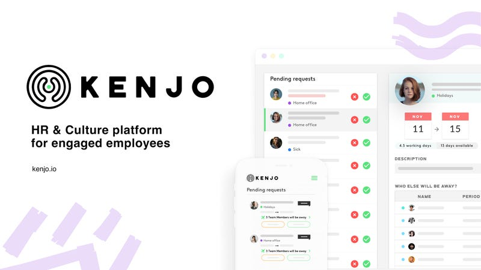
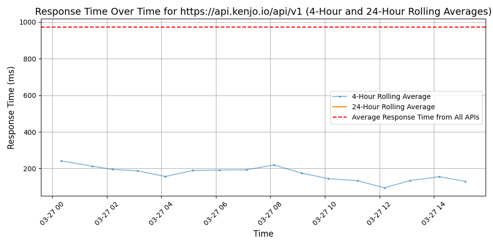
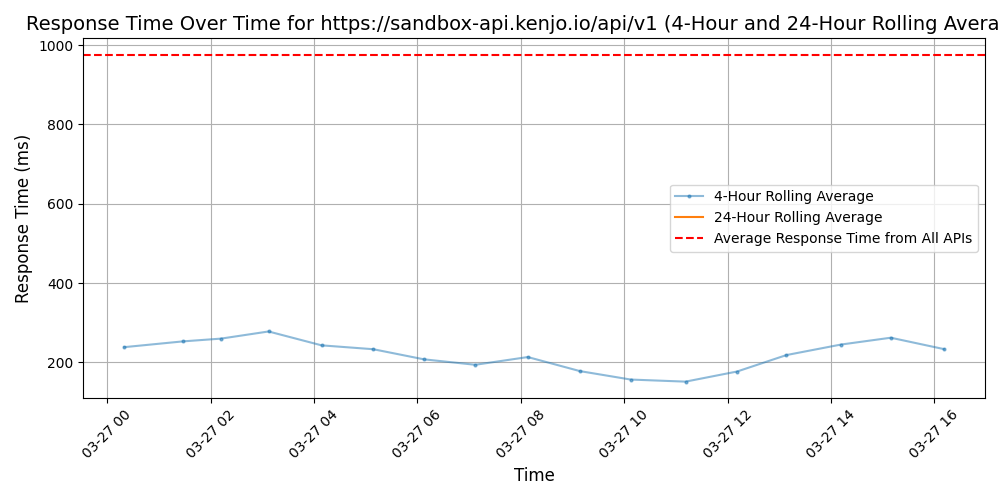

# [Kenjo](https://kenjo.io)

Kenjo is the all in one HR software for managing the workforce of companies in the industrial, service and commercial sectors, among others.

On a single platform, companies can optimise the most important operations and processes in people management: attendance, shift planning and recruitment, among others, while remaining compliant.

All of this with the aim of making HR a key part of the success of companies and the development of their workforce.

## Response Times

#### [api.kenjo.io/api/v1](https://api.kenjo.io/api/v1)

#### [sandbox-api.kenjo.io/api/v1](https://sandbox-api.kenjo.io/api/v1)

