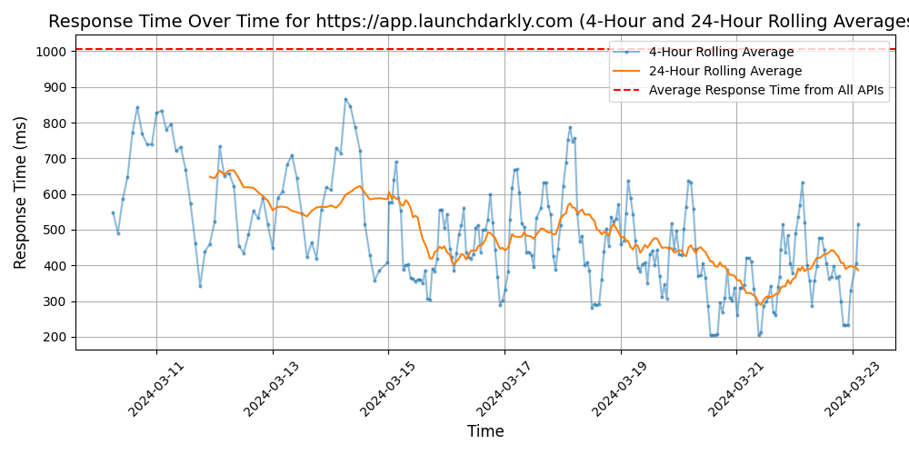
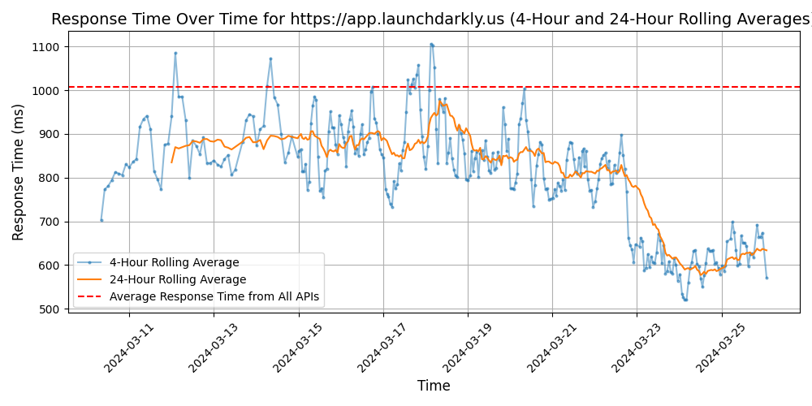

# [LaunchDarkly](https://launchdarkly.com)

LaunchDarkly is a feature management platform that empowers software teams to build better software faster with feature flags. By decoupling features from code deployments, teams can control and manage feature releases, target specific user segments, and monitor feature performance in real-time. With LaunchDarkly, teams can mitigate risks, optimize development workflows, and deliver value to customers with confidence.

## Response Times

#### [app.launchdarkly.com](https://app.launchdarkly.com)

#### [app.launchdarkly.us](https://app.launchdarkly.us)

