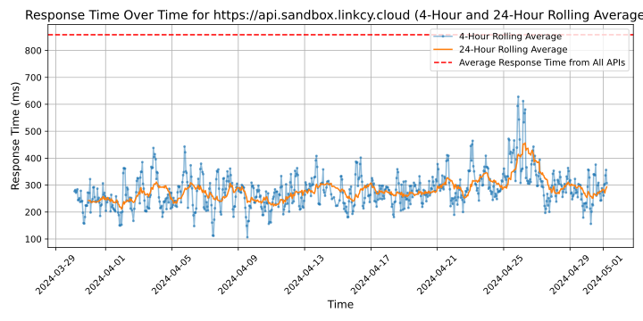

# [LinkCy](https://linkcy.io)

LinkCy is the White Label Banking solution (via App or API) for Global Market in Europe.

Its Plug And Play service enables all Companies to offer accounts (IBANS) and payment cards (Visa / Mastercard) to their users without any regulatory burden, in just a few minutes, compared to 9 to 12 months of technical and regulatory development with other Banking As A Service (BAAS) platforms.

LinkCy is a French fintech start-up incubated at Sation F with BNP Paribas & Plug And Play.

## Response Times

#### [api.sandbox.linkcy.cloud](https://api.sandbox.linkcy.cloud)

