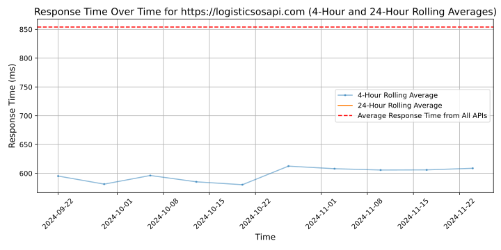

# [LogisticsOS](https://www.logisticsos.com)

We provide an algorithm REST API for companies in the last mile delivery space to dispatch drivers and optimize delivery sequences. Our customers range from traditional logistics companies with fleet management platforms to on-demand delivery companies with mobile apps and drivers. Clients can easily integrate our algorithm into their existing system to find optimal delivery plans. We are also planning to develop on-prem solutions so customers could deploy and host locally for flexibility and data security.

What's different about LogisticsOS?

There are many route optimization products in the market but there are three major flaws with them: They tend to make drivers traveling around the city, take hours to compute a result, and their solutions do not scale well with increasing volume.

We think customers deserve something better. So, we have built a generation leap route optimization engine that solves the above problems by,

Producing solutions with high route density. Drivers are now able to stay in one area.

Producing consistent results and scales linearly with increasing volume.

Significantly reduced computation time, I.e., hours to minutes, and minutes to seconds.

Further reduce the total travel time by another 10%-20%, which results in direct savings for delivery companies.

## Response Times

#### [logisticsosapi.com](https://logisticsosapi.com)

