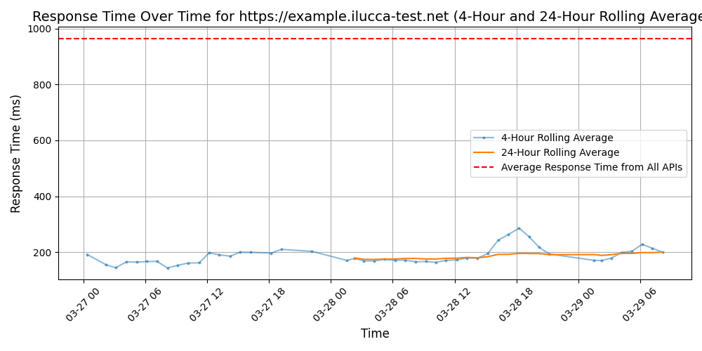
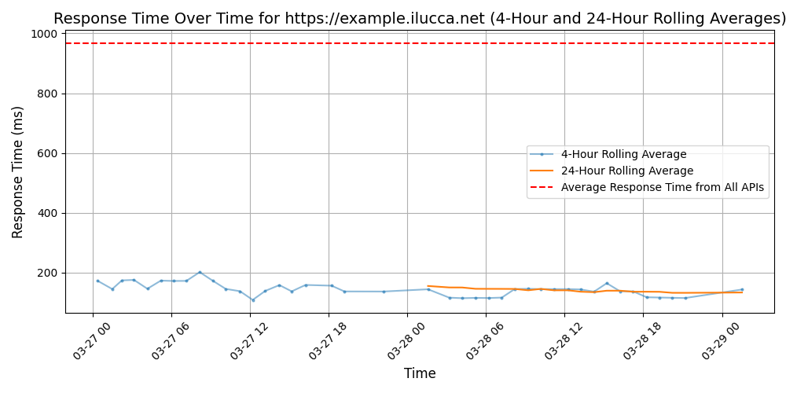

# [Lucca](https://lucca-hr.com)

Nereo est un éditeur de logiciels de gestion des ressources humaines, basé à Saint Etienne, qui propose à ses clients des solutions accessibles en ligne pour faciliter des tâches chronophages et sans réelle valeur ajoutée telles que la gestion des congés, des temps et activités ou encore des notes de frais.

Créée en décembre 2011, Nereo propose déjà une solution complète de gestion de congés et absences en mode SaaS baptisée Nereo Congés.

## Response Times

#### [example.ilucca-test.net](https://example.ilucca-test.net)

#### [example.ilucca.net](https://example.ilucca.net)

