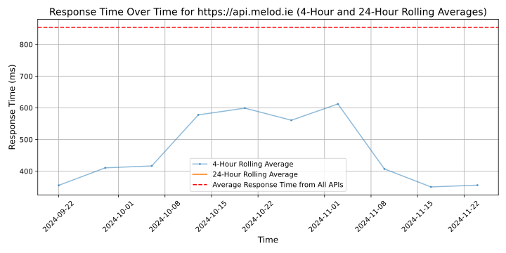

# [Melodie Music](https://melod.ie)

Melodie Music (www.melod.ie) is an Australian company that provides a simple solution for content creators seeking to find and license high-quality music for their projects.

With Creator, Pro and Enterprise subscription options, their exclusive and meticulously curated catalogue of original music is accessible through an online search platform equipped with AI-powered search tools.

Founded by composers, musicians and sound designers with first-hand experience of the crucial role music plays in storytelling, Melodie delivers an intuitive, user-friendly music licensing platform that caters to the needs of content creators, while supporting the growth of the music creators themselves.

Learn more at www.melod.ie

2023 Acquisition International Awarded: *Best Music Platform Australia*
2022 Startup City Awarded: *Top 10 Startups in Australia*
2021 TMN Nominated: "Music Publisher of the Year", "Sync/ Licensing Biz of the Year", "Music Tech Platform of the Year".

## Response Times

#### [api.melod.ie](https://api.melod.ie)

