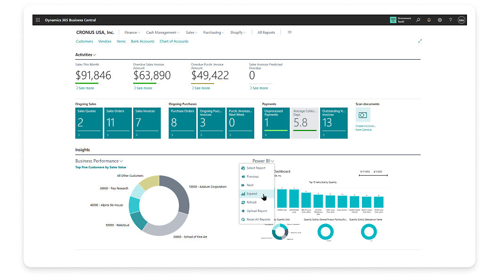
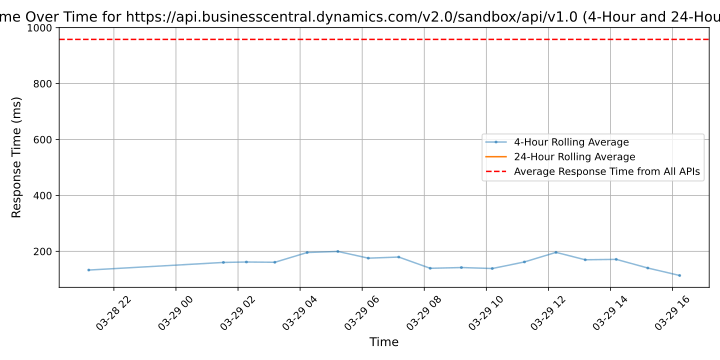

# [Microsoft](https://microsoft.com)

Microsoft is a multinational technology company known for developing, manufacturing, licensing, supporting, and selling computer software, consumer electronics, and personal computers. It is one of the largest technology corporations in the world, with a wide range of products and services including the Windows operating system, Azure cloud services, Office productivity suite, Xbox gaming consoles, and Surface devices.

## Response Times

#### [api.businesscentral.dynamics.com/v2.0/production/api/v1.0](https://api.businesscentral.dynamics.com/v2.0/production/api/v1.0)

#### [api.businesscentral.dynamics.com/v2.0/sandbox/api/v1.0](https://api.businesscentral.dynamics.com/v2.0/sandbox/api/v1.0)

