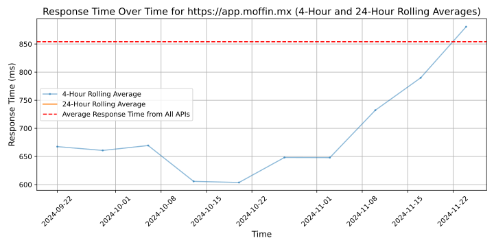
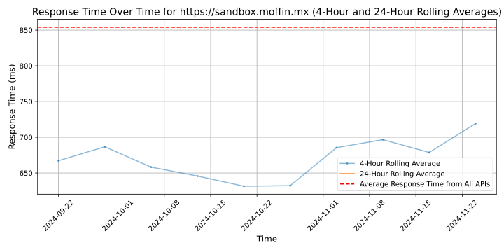

# [Moffin](https://moffin.mx)

Moffin is a leading data integration platform as a service (iPaaS) company that helps its customers digitize client screening and credit analysis. More than 60 companies across Mexico, in industries ranging from financial services to pharmaceuticals, trust Moffin's modern financial infrastructure for the KYC needs. Moffin allows clients to access its platform through either a REST API or no-code forms, saving them tens of thousands of dollars and months of delays from trying to create an in-house client screening solution. Moffin is backed by Ralicap, AngelHub, and Yaydoo.

## Response Times

#### [app.moffin.mx](https://app.moffin.mx)

#### [sandbox.moffin.mx](https://sandbox.moffin.mx)

