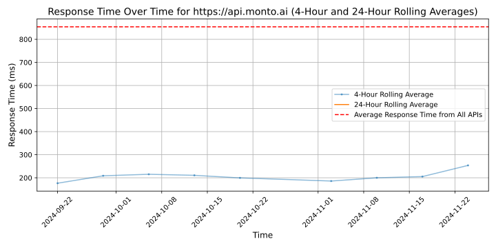

# [Monto](https://monto.ai)

Monto is a Stockholm-based fintech that helps Nordic SME lenders harness the power of real-time data. We combine smart tech and deep industry know-how to help fintechs, banks, lending brokers and BaaS platforms make better credit decisions, streamline processes and improve the customer experience.

With Monto, lenders no longer have to rely on manual, dated or mediocre data sources in their credit reviews. Our API unlocks instant access to up-to-date income statements, ledger quality, financial ratios, and more, fetched from leading accounting software providers in Sweden. We also provide a visual interface that allows credit teams to gain a comprehensive financial understanding of their connected borrowers.

Our platform is tech agnostic and available for a free trial.

## Response Times

#### [api.monto.ai](https://api.monto.ai)

