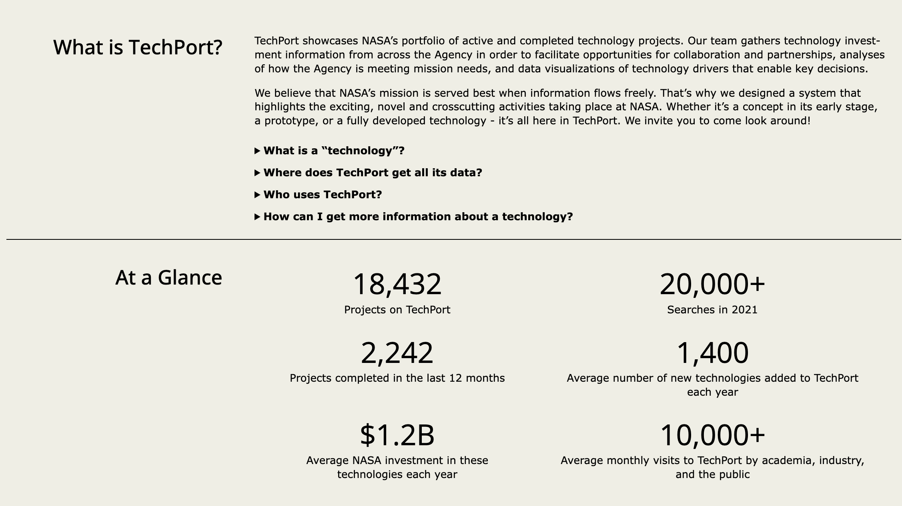
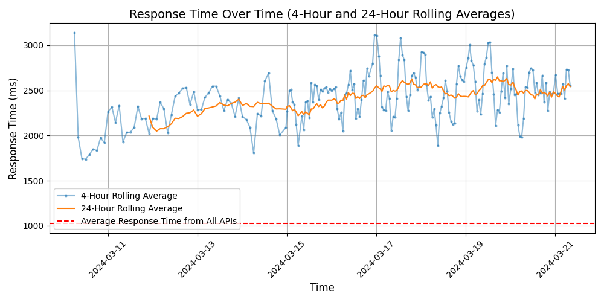

# [NASA](https://techport.nasa.gov/home)

NASA, the National Aeronautics and Space Administration, is an independent agency of the U.S. federal government responsible for the civilian space program, as well as aeronautics and aerospace research. NASA conducts space exploration missions, scientific research, and technology development to expand our understanding of the universe.

## Response Times

#### [techport.nasa.gov](https://techport.nasa.gov)

