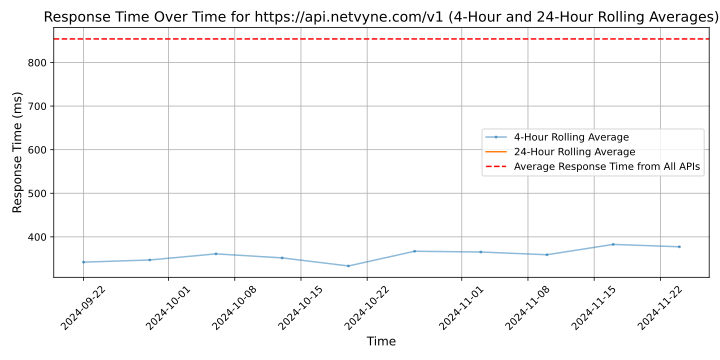

# [Netvyne](https://netvyne.com)

Netvyne provides the APIs and tools for discussion platforms to effortlessly manage and curate their users' comments.

Netvyne's API enforces your own content policy criterion and is tailored to your platform's needs. Netvyne takes a hybrid man-machine approach to bring both low latency and high accuracy moderation, resulting in increased user safety and community growth.

## Response Times

#### [api.netvyne.com/v1](https://api.netvyne.com/v1)

