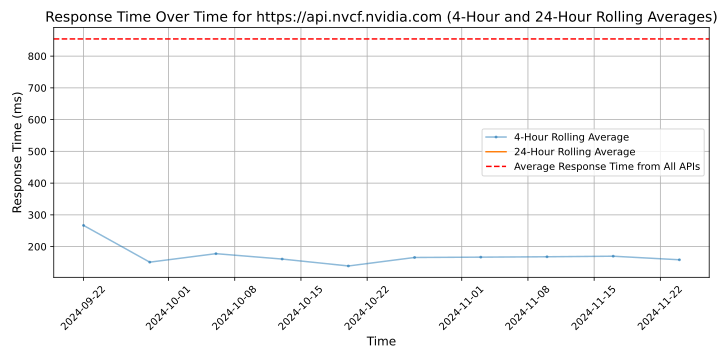

# [NVIDIA](https://www.nvidia.com/en-us/ai)

Since its founding in 1993, NVIDIA (NASDAQ: NVDA) has been a pioneer in accelerated computing. The company's invention of the GPU in 1999 sparked the growth of the PC gaming market, redefined computer graphics, ignited the era of modern AI and is fueling the creation of the metaverse. NVIDIA is now a full-stack computing company with data-center-scale offerings that are reshaping industry.

## Response Times

#### [api.nvcf.nvidia.com](https://api.nvcf.nvidia.com)

