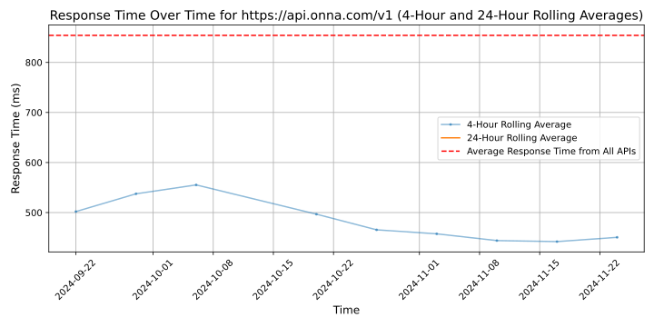

# [Onna](https://onna.com)

Onna enables enterprises to quickly gain business value from their unstructured data. Onna's Data Management Platform provides a central workflow that spans across today's workplace applications like Slack, Google Workspace, Microsoft 365, and more, producing a unified set of actionable data. By connecting and unifying disparate data sources, legal and IT teams enhance key use cases like eDiscovery, internal investigations, and information governance. With teams across North America and Europe, Onna supports some of the world's leading companies, including Dropbox, Electronic Arts, Lyft, Carvana, and NewsCorp.
For more information, please visit us at www.onna.com.

## Response Times

#### [api.onna.com/v1](https://api.onna.com/v1)

