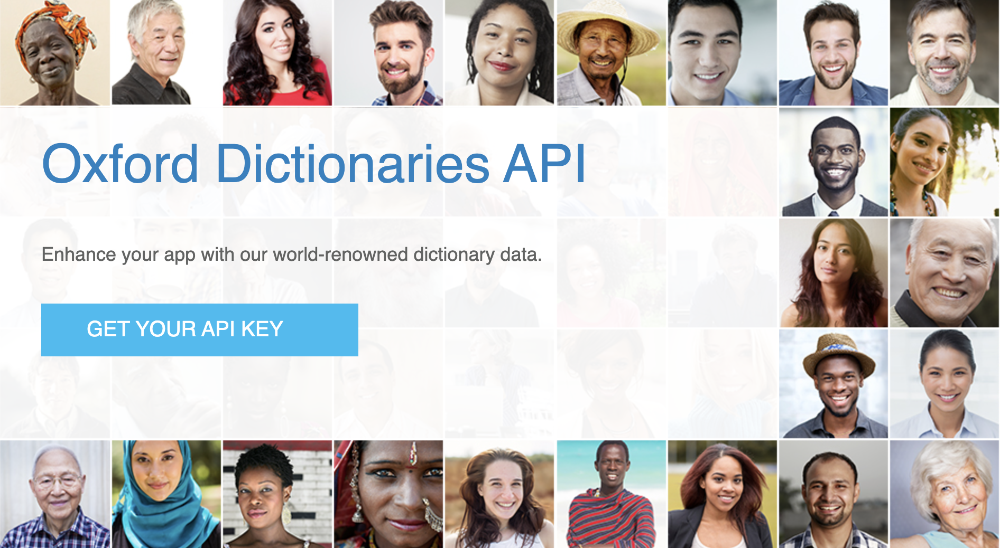
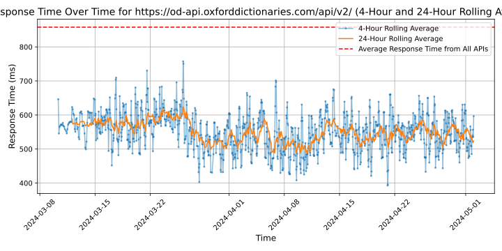

# [Oxford Dictionaries](https://developer.oxforddictionaries.com)

Oxford Dictionaries, part of the Oxford Language Division, is a leading authority on the English language. It offers a wide range of language resources, including dictionaries, thesauruses, grammar guides, and language learning tools. Oxford Dictionaries provides accurate and up-to-date definitions, word origins, and usage examples to support language comprehension and communication.

## Response Times

#### [od-api.oxforddictionaries.com/api/v2/](https://od-api.oxforddictionaries.com/api/v2/)

