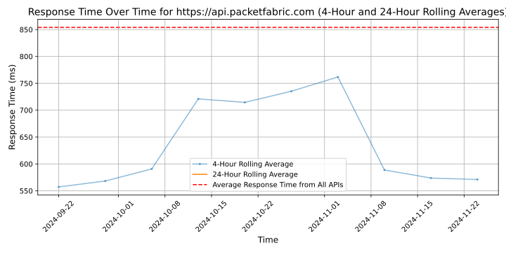

# [PacketFabric](https://packetfabric.com)

PacketFabric is the Connectivity Cloud, designed from the ground up for scale, performance, programmability, elasticity, and security without compromise, enabling enterprises to build an agile cloud core that delivers optimal digital business outcomes. PacketFabric's Network-as-a-Service (NaaS) platform leverages a massively scalable private optical network, the latest in packet switching technology, and end-to-end automation. PacketFabric delivers on-demand, private, and secure connectivity services between hundreds of premier colocation facilities and cloud providers across the globe. IT, network, and DevOps teams can deploy cloud-scale connectivity in minutes via an advanced Application Program Interface (API) and web portal. PacketFabric was recognized as the "2020 Fierce Telecom Innovation Award for Cloud Services," named one of the "10 Hottest Networking Startups of 2020" by CRN, a Futuriom 40 Top Private Company, and a "2020 Cool Vendor in Enhanced Internet Services and Cloud Connectivity" by Gartner. PacketFabric investors include NantWorks and Digital Alpha Advisors. For more information, visit packetfabric.com.

## Response Times

#### [api.packetfabric.com](https://api.packetfabric.com)

