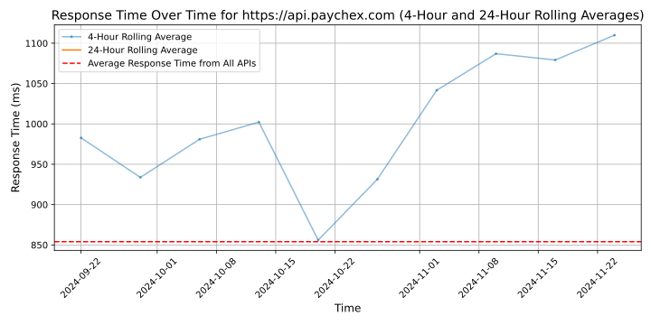

# [Paychex](https://paychex.com)

As the future of work continues to evolve, Paychex leads the way by making complex HR, payroll, and benefits brilliantly simple. Our unique combination of digital HR technology and advisory solutions meets the changing needs of employers and their employees. You can see the results in our growth as an HR leader and the positive returns we deliver to our shareholders.

Paychex, Inc. (Nasdaq:PAYX) is a leading provider of integrated human capital management solutions for payroll, benefits, human resources, and insurance services.

-Industry expertise since 1971
~740,000 business clients in the U.S. and Europe
-Pays 1 in 12 U.S. private sector employees
-A top HR outsourcer — serving 2.2M worksite employees through our HR outsourcing solutions

Information regarding licensing can be found on the NMLS consumer access website, www.nmlsconsumeraccess.org. The Commissioner of Financial Regulation for the State of Maryland will accept all questions or complaints from Maryland residents regarding Paychex, Inc. (1029977) at:

500 North Calvert Street, Suite 402
Baltimore, Maryland 21202
888-784-0136

## Response Times

#### [api.paychex.com](https://api.paychex.com)

