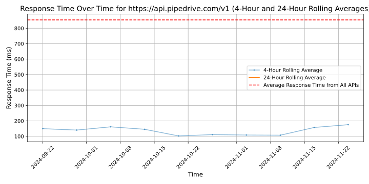

# [Pipedrive](https://pipedrive.com)

Founded in 2010, Pipedrive is an easy and effective sales CRM that drives small business growth.

Today, Pipedrive is used by revenue teams at more than 100,000 companies worldwide. Pipedrive is headquartered in New York and has offices across Europe and the US.

The company is backed by majority holder Vista Equity Partners, Bessemer Venture Partners, Insight Partners, Atomico, and DTCP.

Learn more at www.pipedrive.com.

## Response Times

#### [api.pipedrive.com/v1](https://api.pipedrive.com/v1)

