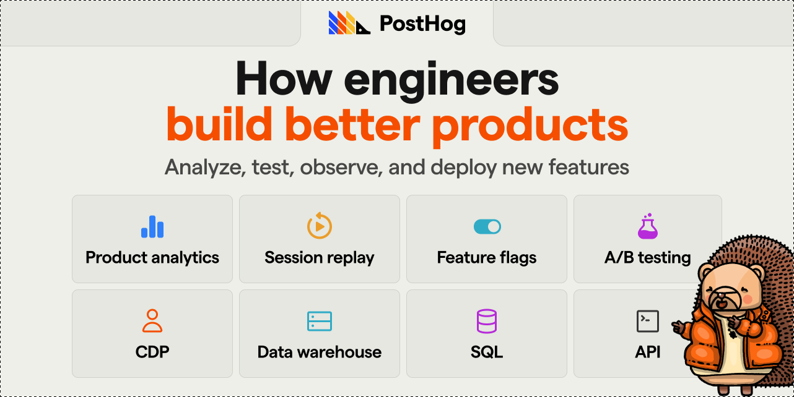
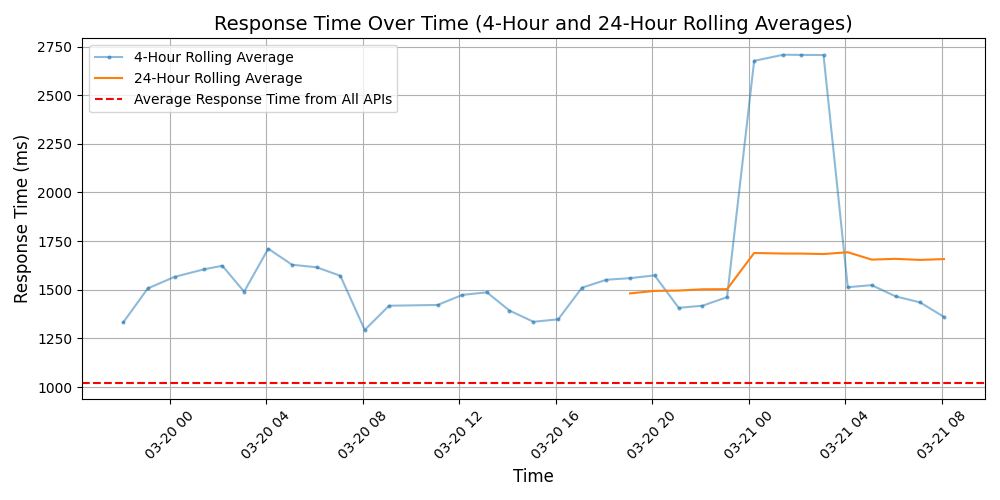
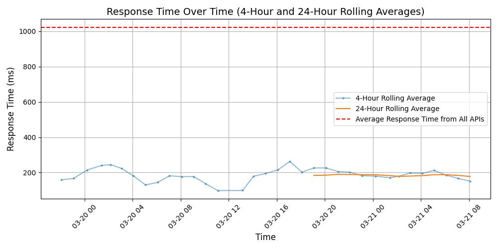

# [PostHog](https://posthog.com)

We're working to increase the number of successful products in the world.

Until now, tools for building products have been fragmented. Product analytics, heatmaps, session recording, feature flags, and A/B testing are all helpful, but no one wants to buy, send data to, and integrate multiple products.

PostHog offers these tools (and more) in an integrated, open source platform which can be hosted in either the US or EU. Both versions are SOC2 certified, GDPR-ready, and HIPAA compliant. 

We started PostHog during YCombinator's W20 cohort and had the most successful B2B software launch on Hacker News since 2012 - with a product that was just 4 weeks old.

With over 50k users, we're default alive, growing 97% through word of mouth, and we are in the top 0.01% most popular repos on GitHub.

## Response Times

#### [app.posthog.com](https://app.posthog.com)

#### [eu.posthog.com](https://eu.posthog.com)

