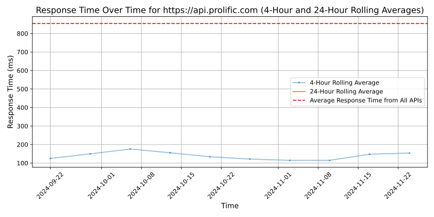

# [Prolific](https://www.prolific.com)

Prolific helps dedicated research teams to collect the very highest-quality human-powered data - at scale - using our simple-to-use platform to target and manage participants from our diverse, vetted participant pool.

The truth matters: the best decisions, and biggest discoveries, are built on the highest-quality data. And with the increasing proliferation of AI, access to reliable, diverse data to develop and train AI models has never been more important.

Created by researchers for researchers, Prolific was founded to provide a better way for researchers and organisations to get high-quality human data and feedback at scale for important research.

Now, more than 30,000 researchers across academia and industry use Prolific to gather definitive human data and feedback from reliable, engaged and fairly-treated participants – with a new study launched every 3 minutes.

## Response Times

#### [api.prolific.com](https://api.prolific.com)

