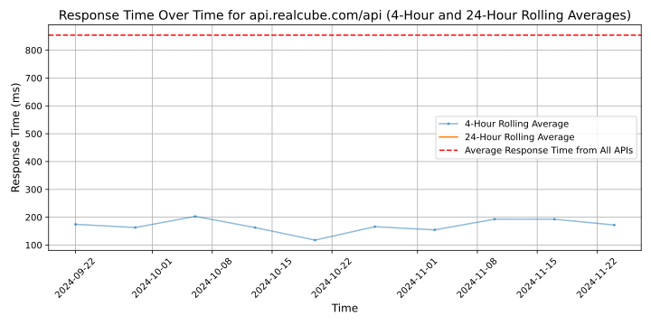

# [Realcube](https://realcube.com)

Realcube is the cloud solution for smart and flexible digitilization in real estate management. Our API-first platform is here to revolutionize the real estate industry. It is a one-stop-shop for intelligent solutions which are adaptive to every client's individual needs.

Realcube's ecosystem offers a growing number of applications from our valuable and industry-leading partners which aggregate the customer's data. It is worth mentioning that we keep our customers' data privacy and well-being as our top priority.
At Realcube, we enable the real estate companies and their contractual partners to consolidate their data in our state-of-the-art platform. This creates a uniform database that gives access to asset managers and other management levels to all relevant information at all times, just a click away!

Have we grabbed your interest in our innovative solution for your real estate management?
Book a free demo today!

For more information feel free to visit our website or contact us at:
info@realcube.com

## Response Times

#### [api.realcube.com/api](https://api.realcube.com/api)

