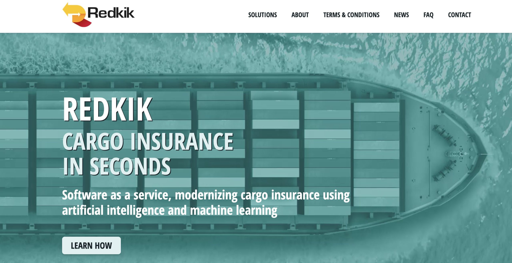
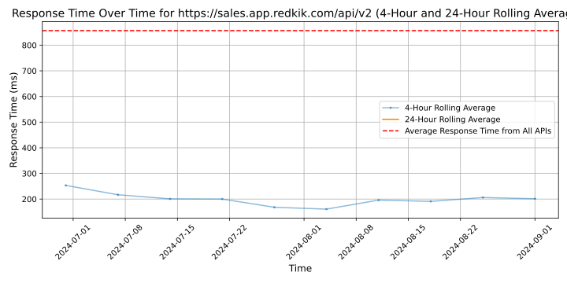

# [Redkik](https://redkik.com)

Redkik is a global InsurTech company with the mission to transform and improve the insurance industry for all parties within logistics and transportation. Redkik's innovative software eliminates the need for annual and complex insurance policies. Through Redkik's embedded integration with licensed insurance providers, existing platforms and online systems can offer their customers tailored and transactional insurance at the time of sale.

Starting as a cargo insurance solution, the market's immediate response has since molded the flexible software to be used to solve additional inefficiencies for warehouse, gap, spike and cyber insurance while multiple other applications are currently being developed.

The team of Redkik has a big passion for innovation and technology,  together with great experience and deep knowledge from logistics and transportation, risk management, cargo insurance, machine learning, and software development.

Join Redkik's rapidly growing network of global partners and exceed your business goals by offering transactional insurance through Redkik's seamless API integration.

## Response Times

#### [sales.app.redkik.com/api/v2](https://sales.app.redkik.com/api/v2)

