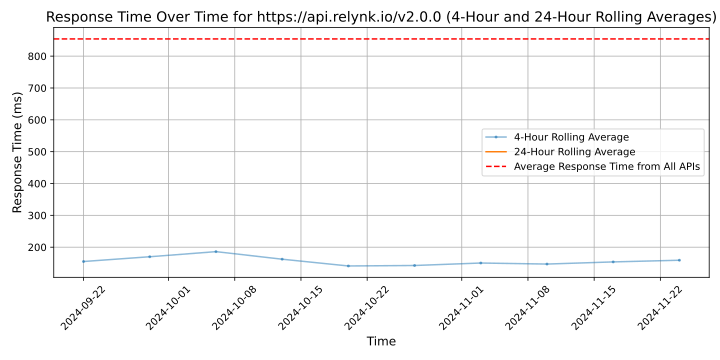

# [Relynk](https://www.relynk.io)

Relynk empowers PropTech companies by providing seamless access to a commercial building's real-time data. Our easy-to-use API platform connects you to an extensive range of real-time information, including occupancy levels, energy usage, ambient conditions, and more, supercharging your data-driven solutions and giving you the edge you need to succeed.

With Relynk, tapping into the expansive network of sensors and IoT devices within any commercial building has never been simpler.

## Response Times

#### [api.relynk.io/v2.0.0](https://api.relynk.io/v2.0.0)

