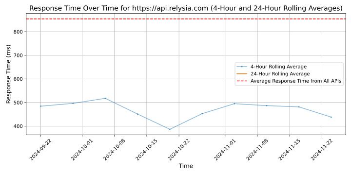

# [Relysia](https://relysia.com)

Relysia is a blockchain as a service provider for any enterprise and commercial companies and start-ups who wish to build their own blockchain applications.

You can use our APIs as building blocks to pick and choose how advanced you want your Bitcoin platform to be.

With over 50 blockchain related APIs, you can build any application you wish. With Relysia API, wallet creation, transactions, data storage, tokens, NFTs and smart contracts are all easy to implement as they require less than 10 lines of code.

We are simplifying Bitcoin application development. By providing our scalable and robust infrastructure, we help businesses reduce their time to market by over 90% allowing them to quickly iterate through ideas and execution strategies to find their product market fit.

You can explore the Relysia API documentation at: https://docs.relysia.com/.
We also have a Swagger implementation for demonstration and testing purposes available at: https://api.relysia.com/docs/.

Our services have empowered many entrepreneurs and companies to actualise their blockchain ideas. Get in touch with us to explore Relysia API in deeper detail.

Relysia by Vaionex Corporation

## Response Times

#### [api.relysia.com](https://api.relysia.com)

