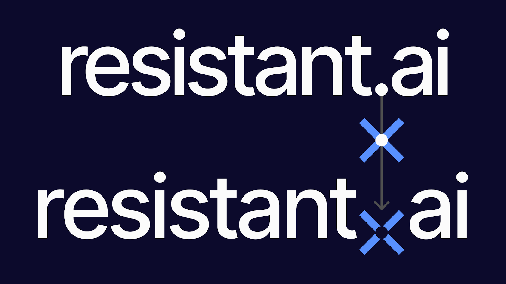
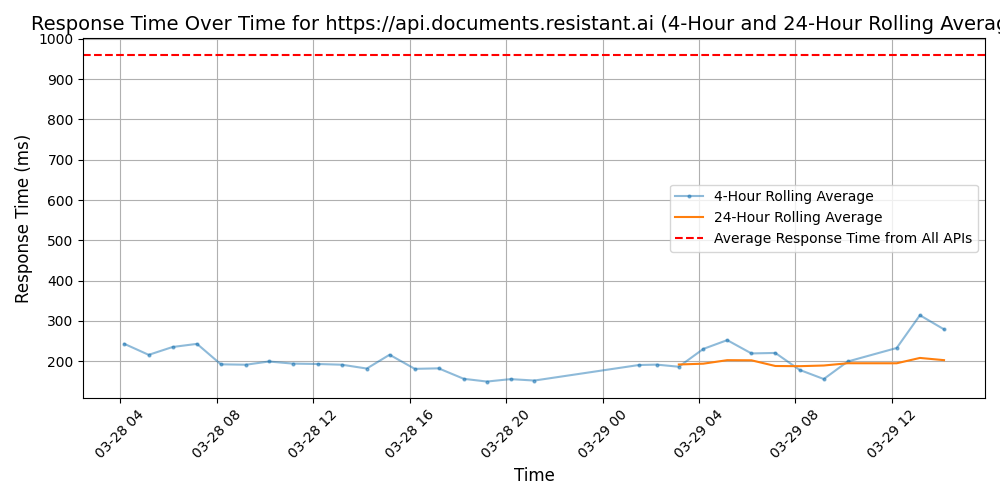

# [Resistant AI](https://resistant.ai)

Resistant AI protects lenders and other fintechs from document fraud.

If you are part of a fraud, risk, operations, or compliance team in the fintech/finance industry, you can now improve your risk and fraud controls, by detecting fraudulent documents automatically, and without replacing your existing systems.

Detect and prevent document fraud in:
• KYB / Merchant Onboarding
• KYC / Customer Onboarding
• Digital Lending / Mortgage Underwriting
• Tenant Screening
• And more.

Some stats:
• 500+ detectors
• Less than 30 sec to get results
• 90% of manual reviews eliminated
• 80% of documents approved instantly
• 99% accuracy in document verdicts
• 50M+ documents analyzed

100+ patents. 100+ customers, including Payoneer, Habito, Planet42, and ComplyAdvantage. Digital Crime Fighter of the Year. Twice Winner of ACAMS'PwC Hackathon. Backed by GV, Index Ventures, Credo Ventures, Seedcamp, and more.

## Response Times

#### [api.documents.resistant.ai](https://api.documents.resistant.ai)

