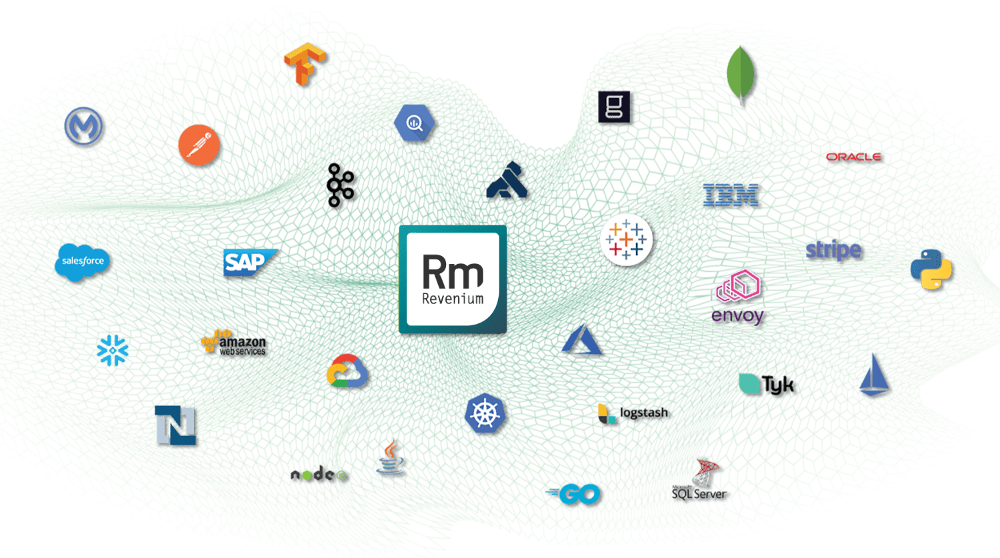
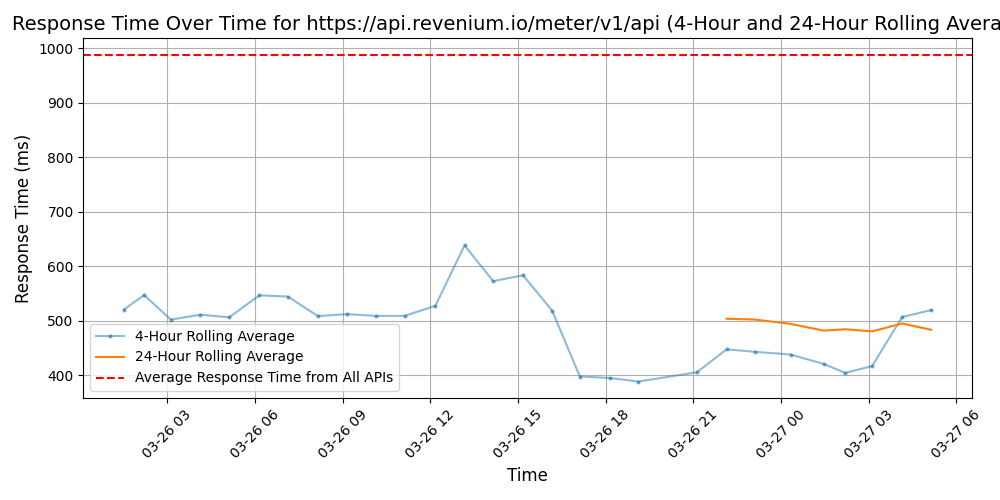

# [Revenium](https://www.revenium.io)

In an era where APIs are pivotal across industries and solutions, Revenium (formerly HyperCurrent) accelerates digital product delivery, revenue generation, and ROI. With "zero code" installation, compatibility with major API management platforms, advanced monetization capabilities, flexible go-to-market tools, and next-gen observability, Revenium is the ideal solution for businesses seeking to turn ideas into income.
What is Revenium? Revenium is a pioneering and indispensable element in the periodic table of digital revenue generation. As a catalyst, it seamlessly exposes APIs and enterprise data assets to bridge the components of digital products to actualize revenue and drive ROI.

## Response Times

#### [api.revenium.io/meter/v1/api](https://api.revenium.io/meter/v1/api)

