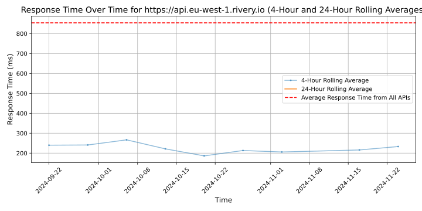
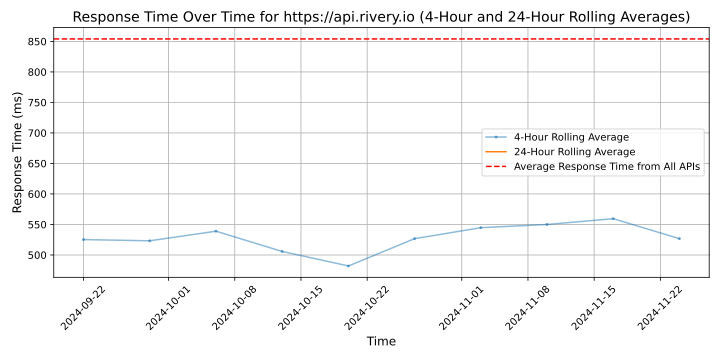

# [Rivery](https://rivery.io)

Whether you're building out your data stack or transitioning to the cloud, managing your data workflows to analyze your business can be a real challenge.

Developing an in-house solution requires valuable resources and upkeep, while integrating several tools adds new layers of complexity.

Rivery's SaaS platform provides a fully-managed solution for data ingestion, data transformation, data orchestration, reverse ETL and more, with built-in support for your data operations development and deployment lifecycles.

Designed to be nimble for non-technical users and with advanced capabilities for experts, Rivery enables you to manage data workflows as the foundation of a modern data stack.

If you're looking to accelerate your time to value, get in touch today.

## Response Times

#### [api.eu-west-1.rivery.io](https://api.eu-west-1.rivery.io)

#### [api.rivery.io](https://api.rivery.io)

