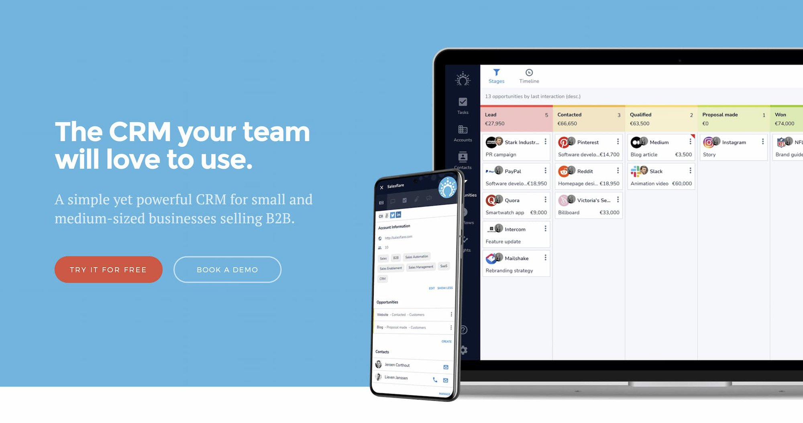
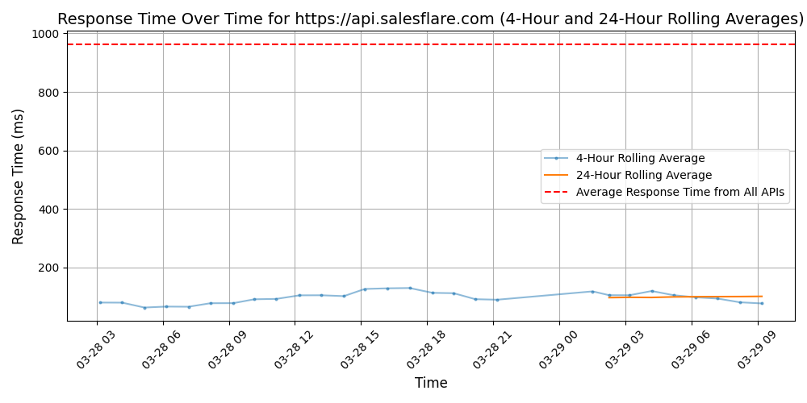

# [Salesflare](https://salesflare.com)

Salesflare is the intelligent CRM startups and small businesses love to use. It's a zero-input sales pipeline tool that thinks and works for its user, not the other way around.

No more manual data entry. Salesflare fills out your address book and keeps track of all interactions with the people you're in contact with. It takes data from social media, company databases, phone, email, calendar and hands it to you in automated customer timelines that tell you everything you need to know. You just have to write the emails, make the calls, and have the coffee.

Never miss a deal again. Salesflare will tell and remind you what to do about leads so deals can't fall through the cracks anymore. Visual pipelines and powerful insights put you in full control of your sales funnel. Intuitive and easy-to-use, Salesflare turns complexity into simplicity so you can turn leads into customers.

Salesflare works wherever you work and with whatever you are working with. Use it on desktop, mobile or just from a sidebar in your email inbox (Gmail and Outlook). Get even more out of Salesflare by integrating with 5000+ other productivity tools, such as Google Apps, MailChimp, Trello and Slack.

There's a free trial available from salesflare.com.

## Response Times

#### [api.salesflare.com](https://api.salesflare.com)

