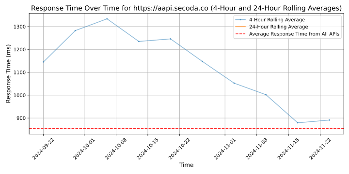
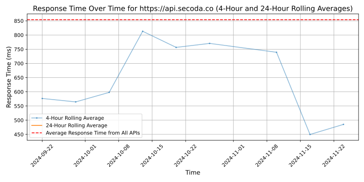
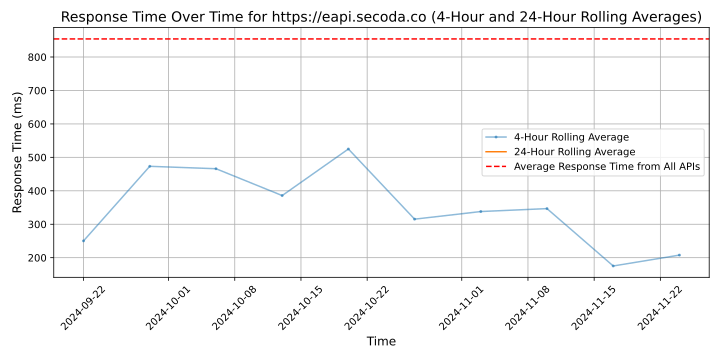

# [Secoda](https://secoda.co)

The all-in-one data management platform. Secoda is the first AI powered data search, catalog, lineage, and monitoring platform to double your data team's efficiency.

Data teams at companies like Panasonic, Mode, and Vanta use Secoda to automate data discovery, documentation, and take the grunt-work out of their day.

By automatically ingesting the metadata across all of your data sources, Secoda makes it easy to make decisions from a single source of truth.

Built for users of the modern data stack, Secoda helps data teams take control of their data sprawl and reliably scale their tech stacks.

With Secoda, data teams save time and enable revenue teams with better data, faster.

## Response Times

#### [aapi.secoda.co](https://aapi.secoda.co)

#### [api.secoda.co](https://api.secoda.co)

#### [eapi.secoda.co](https://eapi.secoda.co)

