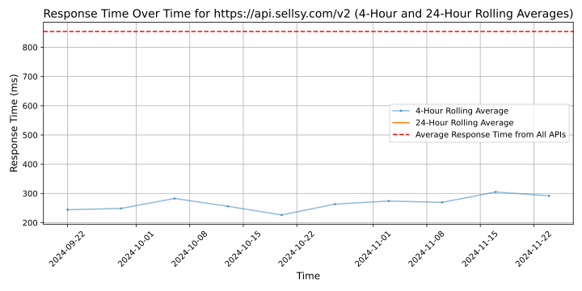

# [Sellsy](https://sellsy.com)

Sellsy is a CRM, invoicing and pre-accounting suite for optimized business management and customer experience. A collaborative tool to give marketing, sales and administrative teams the means to be effective! 🚀

With 6,300 clients, Sellsy surrounds itself with almost 130 employees to carry out its projects. Sellsy remains, above all, a French company created by two entrepreneurs, Frédéric Coulais and Alain Mevellec, for entrepreneurs. Since its creation in 2009, Sellsy has placed innovation at the heart of its strategy, in order to offer companies simple, efficient and secure digital solutions.

👉 To learn more about Sellsy and its CRM suite, visit go.sellsy.com

## Response Times

#### [api.sellsy.com/v2](https://api.sellsy.com/v2)

