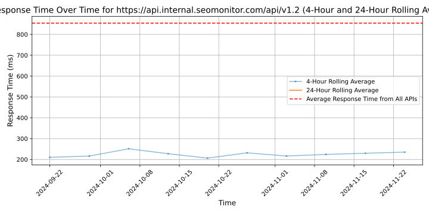

# [SEOmonitor](https://seomonitor.com)

SEOmonitor is the platform that empowers SEO agencies to plan and track keyword performance with high accuracy, connect organic keywords with conversions and sessions, forecast SEO with high precision & algorithm transparency, and research keywords and websites with no restrictions to data. All of that is connected in a specifically designed dashboard that gathers all critical customer data in one place. API, Google Sheets, and Data Studio are included in a dynamic subscription — where users pay only for what they use.

## Response Times

#### [api.internal.seomonitor.com/api/v1.2](https://api.internal.seomonitor.com/api/v1.2)

