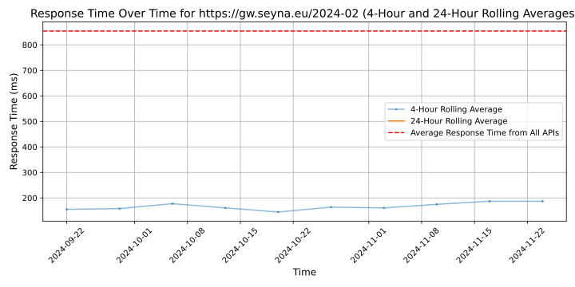

# [Seyna](https://seyna.eu)

Seyna est la plateforme pour les courtiers en assurance. En combinant produits d'assurance sur mesure et technologie, la plateforme Seyna permet aux courtiers de focaliser sur l'essentiel : leurs clients. Les courtiers opérant sur Seyna peuvent se concentrer sur l'expérience client en automatisant les tâches administratives et de conformité ainsi qu'en créant des expériences assurantielles sur-mesure. Infrastructure ouverte, les courtiers peuvent adapter Seyna à leurs besoins, brancher leur ecosystème de prestataires et piloter toute leur activité via une seule interface.

Aujourd'hui, plus de 90 courtiers d'assurance et retailers font déjà appel à Seyna pour protéger plus de 1 million de clients. Mais l'histoire ne s'arrête pas là. Seyna nourrit des ambitions mondiales et entend changer la façon dont l'ensemble du secteur protège les clients.

## Response Times

#### [gw.seyna.eu/2024-02](https://gw.seyna.eu/2024-02)

