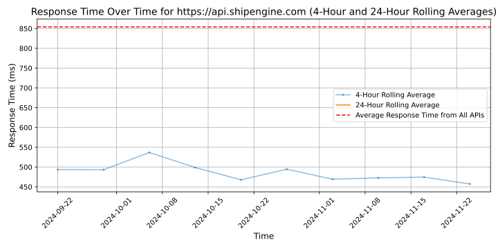

# [ShipEngine](https://shipengine.com)

ShipEngine is the leading multi-carrier shipping API. Our highly efficient API helps brands, platforms and third-party logistics providers drive efficiency and cost savings through a network of 70-plus carriers worldwide. You can invest significant resources into building carrier and order source integrations. And, after those integrations are built, you can continue exhausting resources to maintain them. Many businesses choose this expensive, time-intensive path — only to realize the approach is unsustainable.

There's a better alternative: Integrate once with ShipEngine and never worry about building or maintaining integrations again. Spend your team's valuable time and money on projects that are core to growing your business, rather than dealing with legacy carrier integrations. In addition to the ROI you achieve after implementing ShipEngine, our shipping API also offers pre-negotiated, discounted rates through the USPS, UPS and DHL. Our users report that shipping-related tasks that once took minutes now take seconds, and that ShipEngine's features and capabilities help unlock thousands in savings.

Getting started with ShipEngine is easy.

Visit our API documentation and start building with our SDKs at shipengine.com/docs/

Schedule time to talk to one of our shipping experts by visiting shipengine.com/contact/

Or get a free API key and start building, no credit card required, at shipengine.com/signup/

## Response Times

#### [api.shipengine.com](https://api.shipengine.com)

