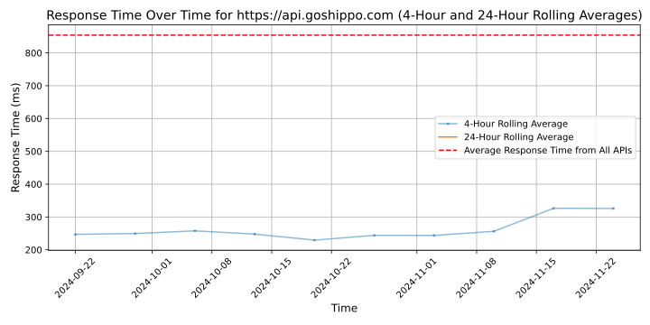

# [Shippo](https://goshippo.com)

Shippo lowers the barriers to shipping for businesses around the world. As free and fast shipping becomes the norm, better access to shipping is a competitive advantage for businesses.

Through Shippo, ecommerce businesses, marketplaces, and platforms are able to connect to multiple shipping carriers around the world from one API and dashboard. Businesses can get shipping rates, print labels, automate international documents, track shipments, and facilitate returns. Internally, we think of Shippo as the building blocks of shipping.

Everyday we solve core operational problems for our users and businesses. We work hard to provide value and deliver quality results. We understand that our success is directly tied to the success of our customers.

Shippo is made up of a diverse set of individuals from around the world and across a variety backgrounds. Specifically, we look for culture and skill add from each person. We believe in self-directed growth, putting away our egos and rolling up our sleeves to get important work done everyday. If that sounds like you, join our team and help build the foundation of something great. https://goshippo.com/jobs/

Founded in 2013, we are a proud team of 200+ based out of San Francisco and Austin. Shippo's investors include Union Square Ventures, Uncork Capital, VersionOne Ventures, FundersClub and others.

Learn more about Shippo: https://goshippo.com/

## Response Times

#### [api.goshippo.com](https://api.goshippo.com)

