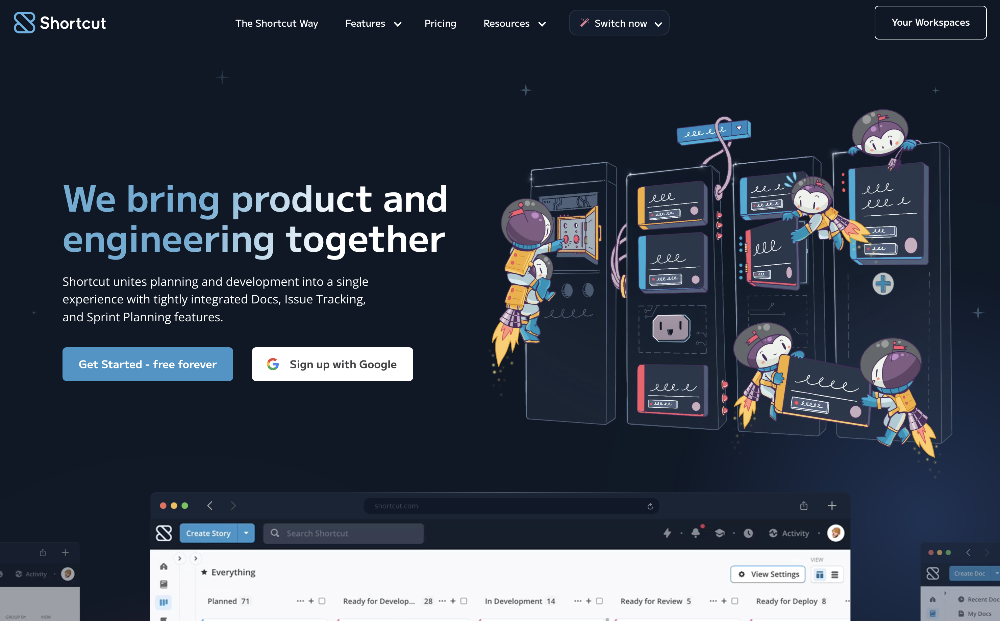
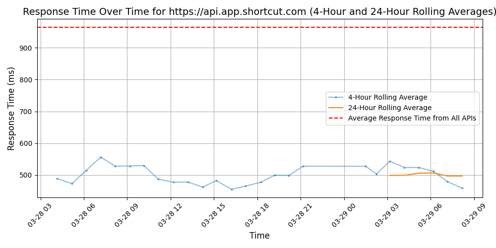

# [Shortcut](https://shortcut.com)

Shortcut is the first project management platform for software development that brings together every team across an organization to build better products. More than 10,000 companies worldwide use Shortcut to facilitate healthier planning and collaboration so teams can focus on what matters – creating software their customers love. A Great Place to Work-Certified™ company, Shortcut is headquartered in New York City with employees spread across the globe and is backed by Battery Ventures, Resolute Ventures, Lerer Hippeau Ventures, and a number of other top-tier investors.

Visit https://www.shortcut.com to learn more.

## Response Times

#### [api.app.shortcut.com](https://api.app.shortcut.com)

