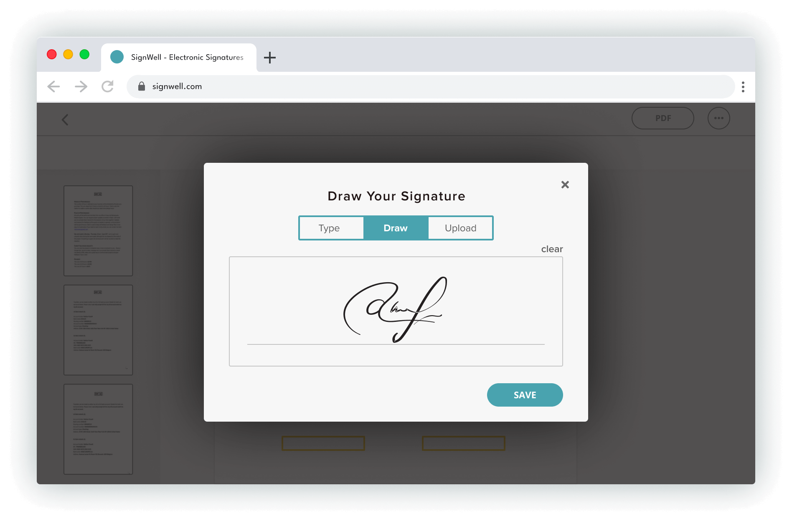

# [SignWell](https://signwell.com)

When I started SignWell in 2019, I saw there was a need for an alternative to the hard-to-use and expensive e-signature software already out there. Documents can be complicated enough, but getting a document signed shouldn't be complicated too.

At SignWell, we pride ourselves not only on the ease and affordability of our e-signature process but also on our personalized and industry-leading customer support — whether it's for individual use or larger team accounts, SignWell is here to help you feel comfortable and confident getting your documents signed.

The SignWell mission? Simplify how documents get signed for millions of people and businesses. We're excited to help you continue to move toward the future of paperless document signing.

Ruben Gamez
Founder, SignWell

