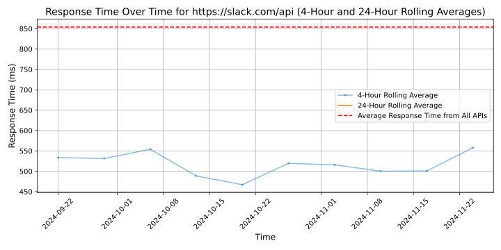

# [Slack](https://slack.dev)

Slack is a popular messaging platform designed for teams and workplaces. It offers real-time messaging, file sharing, and collaboration tools to help teams communicate and work together effectively. Users can create channels for different topics, send direct messages, and integrate with other apps for seamless workflow management.

## Response Times

#### [slack.com/api](https://slack.com/api)

