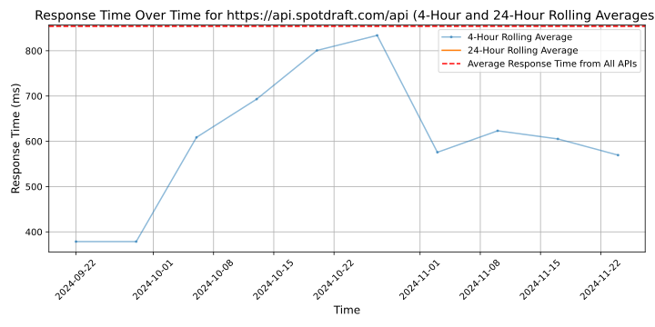

# [SpotDraft](https://spotdraft.com)

Businesses like Notion, ChargeBee, Turing, Airbnb, CRED, and more trust SpotDraft to help:

- their in-house legal team automate repetitive, mind-numbing aspects of contracting and free up time so they can focus on high-leverage work.
- their business teams close more contracts on their own without depending on legal for every small edit and review.
- bring more speed, visibility, efficiency & structure to the entire contracting process, and more.

Founded by a Harvard Law School lawyer and two Carnegie Mellon computer scientists, SpotDraft is the perfect co-pilot for your legal team that democratizes legal paperwork and speeds up the contract lifecycle.

## Response Times

#### [api.spotdraft.com/api](https://api.spotdraft.com/api)

