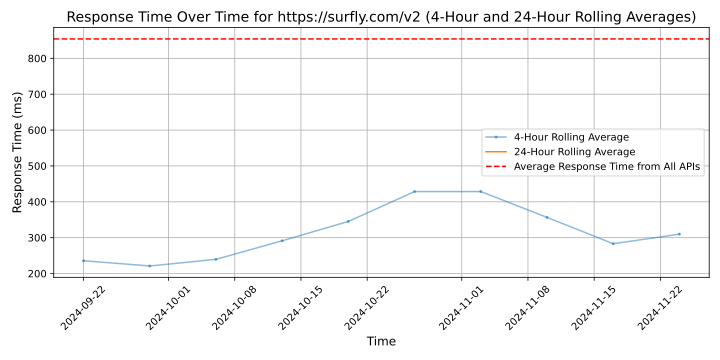

# [Surfly](https://www.surfly.com)

Surfly is a high-growth interaction middleware player that can share, secure, and transform web experiences. We're on a mission to create (and be) the next wave of online interactions, currently powering online in-person experiences for 200,000+ users worldwide.

Our solution enables anyone to add a collaborative layer to any web application without having to modify or change the original application. Leading organizations use Surfly to accelerate remote deal-closing, collaborate better with seamless functionality, and engage with their own customers in a more efficient and meaningful way. 

Backed by powerful technology and API-first approach, Surfly's industry-leading Co-browsing product recreates an in-person experience as part of a digital customer journey, and helps companies thrive in the era of digital transformation and remote service distribution. With Surfly, you can innovate online interactions in real-time, however you want, without creating cumbersome integrations or continually adding complex and costly technology.

A Surfly Session is equipped with co-browsing, video & voice chat, secure e-signing, responsive document annotation and completion, file sharing, and more. Our customers can use the technology on its own, integrate with their own tool stack, or even build on top of it to gain a competitive advantage, innovate faster, and elevate their customers' experiences.

Surfly is built to meet the highest security standards and regulations— it's compliant by design. The entire Surfly Session has been developed to act as infrastructure, with information only passing through but never stored. And when no data is stored, no data can be lost. This enables us to be ISO 27001, HIPAA, PCI DSS, AICPA SOC, and GDPR compliant.

We are hiring: https://jobs.surfly.com

## Response Times

#### [surfly.com/v2](https://surfly.com/v2)

