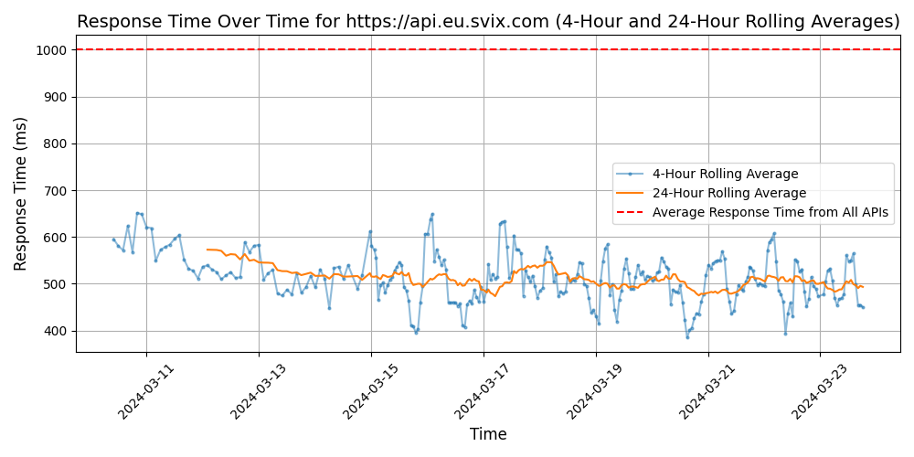
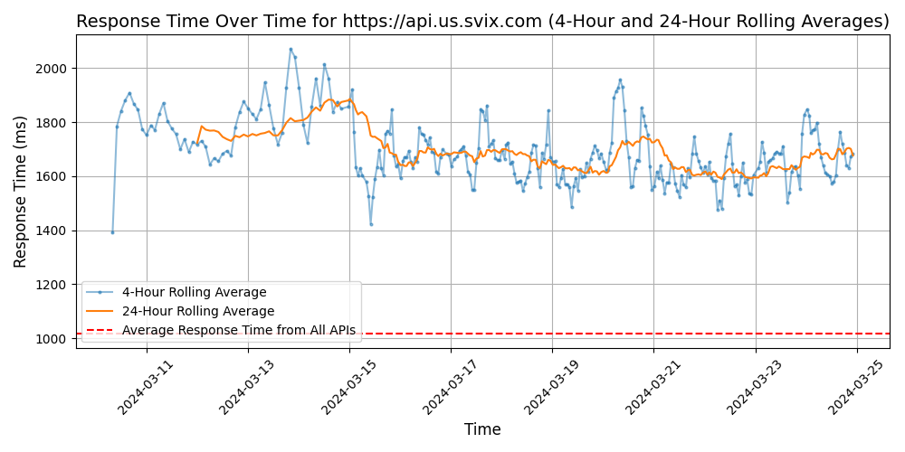

# [Svix](https://svix.com)

Svix is a platform that simplifies webhook processing for developers. By providing a reliable infrastructure and powerful tools, Svix enables developers to easily send and receive webhooks, ensuring seamless communication between services and applications.

## Response Times

#### [api.eu.svix.com](https://api.eu.svix.com)

#### [api.us.svix.com](https://api.us.svix.com)

