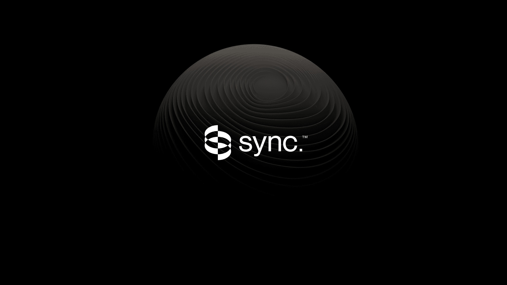
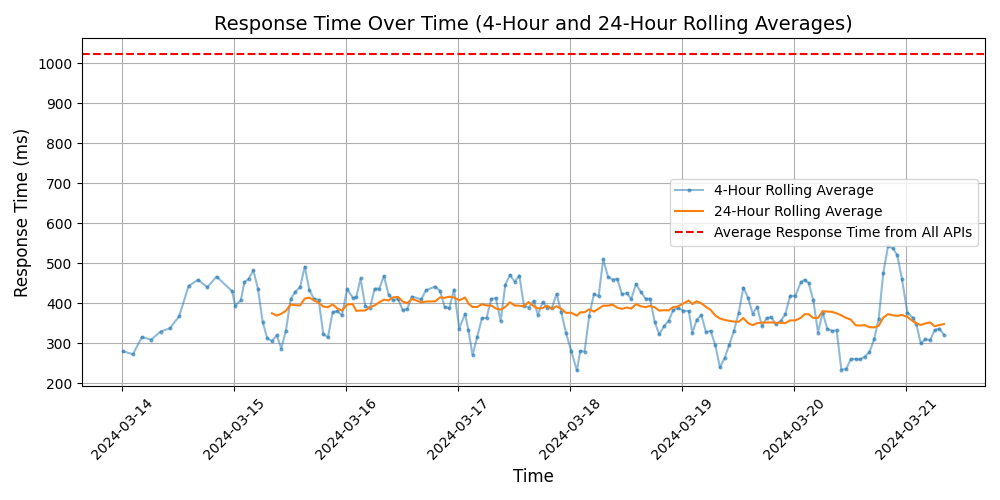

# [sync. labs](https://synclabs.so)

building generative models to modify + synthesize humans in video. 

the first product we released is our synchronizer – a state-of-the-art lip-syncing model to sync a video to any audio in any language. 

why is this important?

Imagine a world where you can watch your favorite films, content creators, or learn anything you want in your native tongue — seamlessly.

language should no longer be a barrier. 

we're building a suite of audio / video models to change how we live, work, and play.

## Response Times

#### [api.synclabs.so](https://api.synclabs.so)

