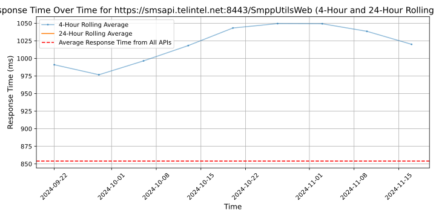

# [Telintel](https://telintel.com)

With +20 years of experience in the market, Telintel makes the experience of communicating with your clients easier. We are leaders on technological solutions that makes the interaction with any user simpler no matter neither the business size nor the industrial sector at hand. Our products based on SMS and VoIP (SMS 2-Way, Landing Pages, RoboCall, Text2Speech, IVR, SMS2Call & Click2Call) allow us to offer a vast service spectrum for any need including reminders, alerts, promotions and client loyalty, along with commercial presence on any the continents around the world.

Our Go4Clients and TestMySMS platforms will allow you to enhance your user experience, centralize operational processes and improve your response times with the best service quality and 24/7 technical support, 365 days a year. These are smart solutions that will allow you to have infinite possibilities at your hands reach.

We count on our strategic allies and important customers satisfied with our services. Be one of them today and contact us at social@telintel.net or give us a call at +1 786-871-6540.

Con más de 20 años de experiencia en el mercado, Telintel hace más sencilla la manera de comunicarse con sus clientes. Somos líderes en soluciones tecnológicas que hacen más simple la interacción con cualquier usuario sin importar el tamaño de su organización o la industria a la que se dedique. Nuestros productos basados en SMS y VoIP (SMS 2way, Landing Page, Robocall, Text2Speech, IVR, SMS2Call y Click2Call) nos permiten ofrecer una amplia gama de servicios para cualquier necesidad incluyendo recordatorios, alertas, promociones y fidelización de clientes en todo el mundo, con presencia comercial en los 5 continentes.

Nuestras plataformas Go4Clients y TestmySMS le permitirán mejorar la experiencia de sus usuarios con el mejor servicio y soporte 24/7 los 365 días del año, centralizar procesos operativos y mejorar sus tiempo de respuesta.

## Response Times

#### [smsapi.telintel.net:8443/SmppUtilsWeb](https://smsapi.telintel.net:8443/SmppUtilsWeb)

