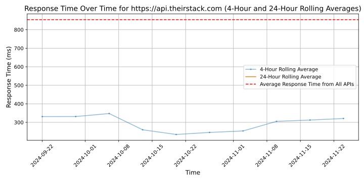

# [TheirStack](https://theirstack.com)

TheirStack is a sales tool designed to discover purchase intent signals through job postings. It helps SaaS companies, recruiting agencies and consulting firms find their next customer by analyzing 40 million job listings across 100 countries.

It features instant alerts on new openings, identifies companies based on technology use, and pinpoints those with specific software needs.

Primarily used by sales and marketing teams, it facilitates lead generation and enrichment, targeted marketing, and offers data-driven insights while significantly reducing research time.

## Response Times

#### [api.theirstack.com](https://api.theirstack.com)

