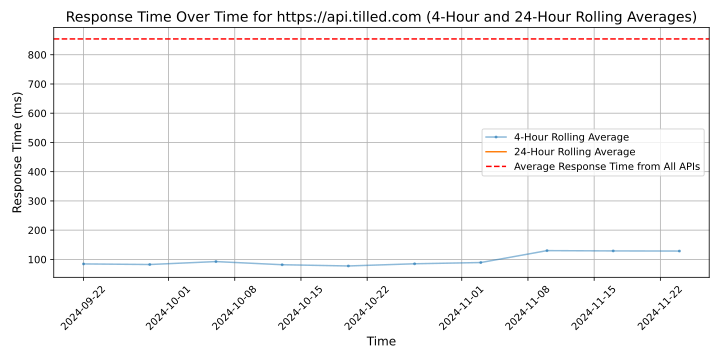
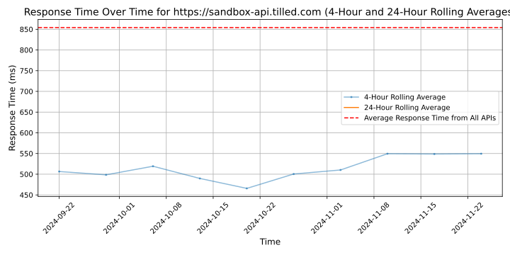

# [Tilled](https://tilled.com)

Tilled was created to empower software vendors, marketplaces, and SaaS companies to start generating revenue from accepting credit cards. With our suite of powerful financial tools and industry leading revenue sharing programs, Tilled will power the financial backend of the next generation of marketplaces, SaaS companies, and integrated software vendors allowing them to focus on their core product, not payments. We enable these companies to enjoy all the benefits of a fully registered payment facilitator program without the upfront cost, hassle, or liability. Welcome to Payfac-as-a-service. Plug in our easy to implement APIs and start making revenue from credit card processing today. For far too long options like Stripe and Braintree have had a monopoly on the market, and have charged far too much for their services. For B2B software companies looking for a better option that provides all of the benefits with none of the hassle, it's time to Get Tilled and experience Payfac-as-a-Service.

## Response Times

#### [api.tilled.com](https://api.tilled.com)

#### [sandbox-api.tilled.com](https://sandbox-api.tilled.com)

