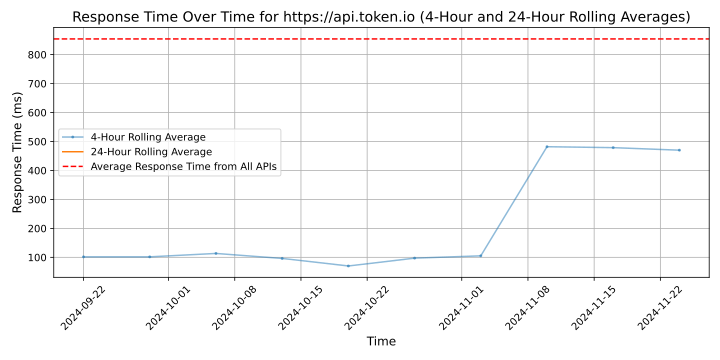

# [Token](https://token.io)

With the simplest and fastest way to launch Pay by Bank as a core payment method globally, Token.io's complete A2A payment infrastructure helps payment providers grow their market share in the face of the continued shift from cards to APMs.

Token.io delivers the highest performing and deepest connectivity in the industry, reaching 567 million bank accounts (80%+ per market) in 20 supported countries through a single API and interface.

With fast and flexible deployment options, including the option to use Token.io's license and conversion boosting payment authentication flows, payment providers can quickly and easily launch and manage Pay By Bank capabilities.

Token.io's solution is proven by a blue-chip base of partners, which collectively process payments for tens of millions of merchants worldwide, including HSBC, Mastercard, BNP Paribas, ACI Worldwide, Total Processing, Computop, Nuvei and Paysafe.

As Token.io pushes the boundaries of innovation, it remains relentlessly focused on delivering infrastructure that enables payment providers to grow their business. Token.io also provides access to aggregated bank account and transaction data, enabling payment providers to enrich their services and reinvent financial experiences.

Token.io is authorised as an AISP & PISP by the FCA in the UK and by BaFin in Germany. Token.io is PSD2 and SCA compliant, and PCI-DSS Level 1 and ISO27001:2013 Certified.

— RECOGNISED BY —

"Token.io provides an innovative solution in the Open Banking payments landscape…" — Juniper Research
"Token.io's strength is payment infrastructure…" — Forrester
"One of the fastest growing fintechs of 2022… " — Sifted

🏆 Open Banking Platinum Innovation Award - Juniper Research 2023 and 2022
🏆 Payments Tech of the Year - Europe Fintech Awards 2023
🏆 Fintech for Good Award - Paytech Awards 2023
🏆 Qorus-Capgemini NewTech Payments Bronze Award - 2023
🏆 Payments Tech of the Year Award - Fintech Awards London 2022

## Response Times

#### [api.token.io](https://api.token.io)

