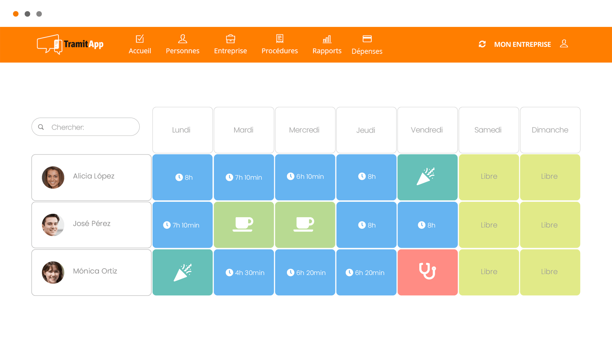
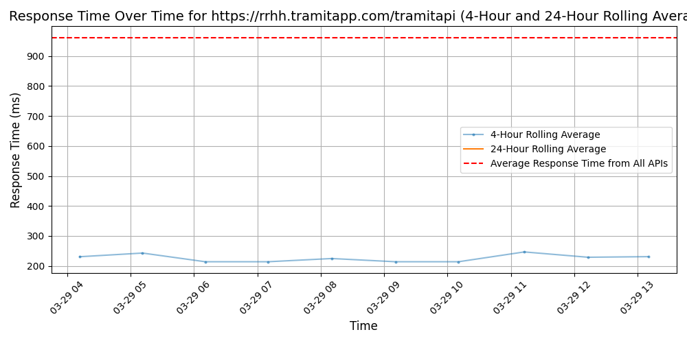

# [TramitApp](https://www.tramitapp.com/en)

TramitApp es la App de Gestión de Recursos Humanos con la que ahorrarás tiempo y gestionarás fácilmente y en la nube los tediosos papeleos.

Podrás controlar EN TIEMPO REAL y DESDE TU MÓVIL el registro horario de tus empleados, vacaciones del equipo, nóminas, gastos, kilometraje, dietas, ausencias y bajas médicas.

Somos una plataforma centrada en "la experiencia de empleado" y contamos con una APP DE EMPLEADO para eliminar por completo el papel y los errores.

Es segura y cumple estrictamente con los requisitos legales. Incorpora firma electrónica y reconocimiento facial.

Se trata de un sistema flexible para todos los sectores y con una implementación sencilla para grandes, medianas y pequeñas empresas a través de la integración de una API con otros sistemas.

Además:
· Sin costes de mantenimiento.
· Sin papeles.
· Con comunicación con tu gestoría.
· Con posibilidad de integración con sistemas de nóminas.
· Con soporte.

## Response Times

#### [rrhh.tramitapp.com/tramitapi](https://rrhh.tramitapp.com/tramitapi)

