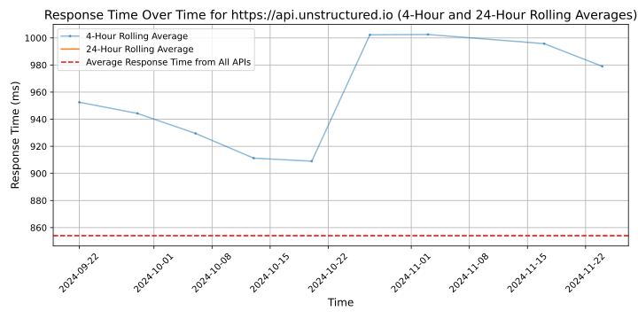

# [Unstructured](https://unstructured.io)

At Unstructured, we're on a mission to give organizations access to all of their data. We know the world runs on documents—from research reports and memos, to quarterly filings and plans of action, documents are the unit of information that companies depend on. And yet, 80% of this information is trapped in inaccessible formats, and businesses have long struggled to unlock this data, leading to information silos, inefficient decision-making, and repetitive work. Until now.

Unstructured captures this unstructured data wherever it lives and transforms it into AI-friendly JSON files for companies who are eager to fold AI into their business.

## Response Times

#### [api.unstructured.io](https://api.unstructured.io)

