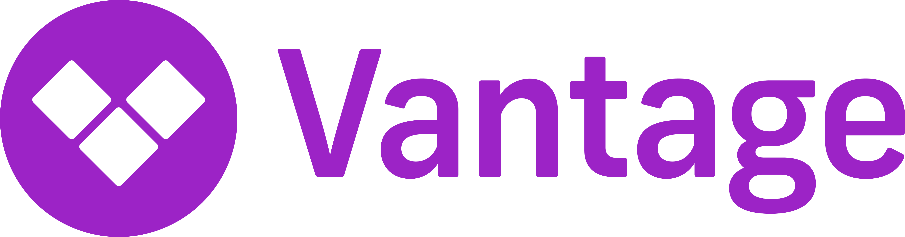
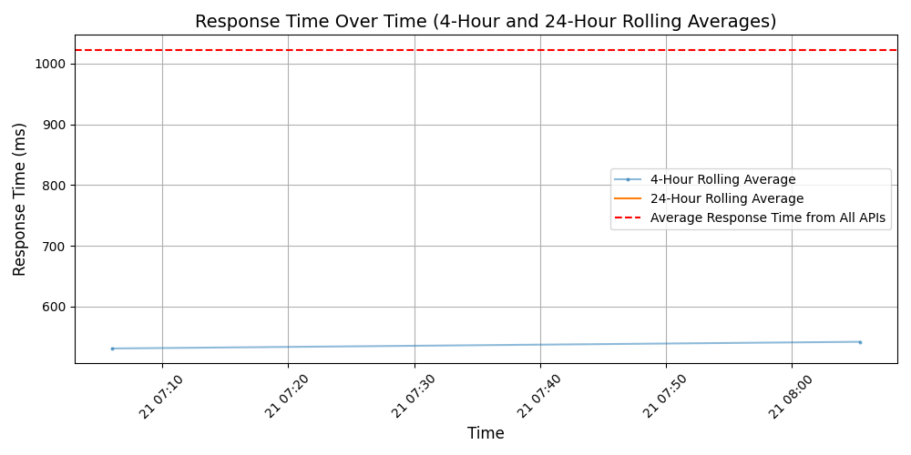

# [Vantage](https://vantage.sh)

Vantage is a cloud cost observability platform with more than a dozen native integrations, including AWS, Azure, GCP, Kubernetes, Datadog, Snowflake, Databricks and more. Thousands of organizations globally, ranging from startups to F500 companies, rely on Vantage to optimize billions of dollars in annualized infrastructure costs. Vantage was founded by former employees of AWS, Digital Ocean, and GitHub and is backed by top venture capital firms, Andreessen Horowitz and Scale Venture Partners.

## Response Times

#### [api.vantage.sh/v2](https://api.vantage.sh/v2)

