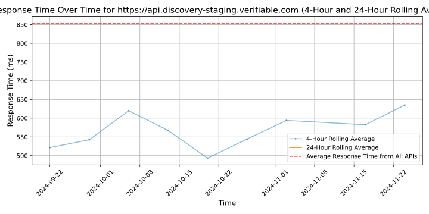
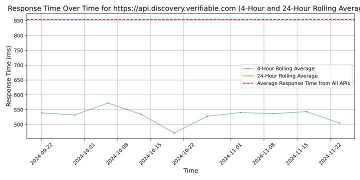

# [Verifiable](https://verifiable.com)

Verifiable is an API-first, provider network management platform built to help healthcare provider and payer organizations speed up network operations, save costs and streamline the provider experience.

Verifiable industry-leading provider data infrastructure connects to thousands of primary sources to deliver real-time provider verification & monitoring to automate the credentialing process - resulting 78% faster turnaround times and millions in added revenue capture.

Verifiable works with innovative healthcare provider and payer organizations like Humana, Lyra Health, Talkspace, Modern Health, Wheel, Grow Therapy, and many others. Verifiable is a proud Y-Combinator company whose investors include Craft Ventures, Highland Capital Partners, Tiger Global, The Altman Fund, Struck Capital, Liquid2 Ventures, 137 Ventures, Cooley and Soma Capital.

## Response Times

#### [api.discovery-staging.verifiable.com](https://api.discovery-staging.verifiable.com)

#### [api.discovery.verifiable.com](https://api.discovery.verifiable.com)

