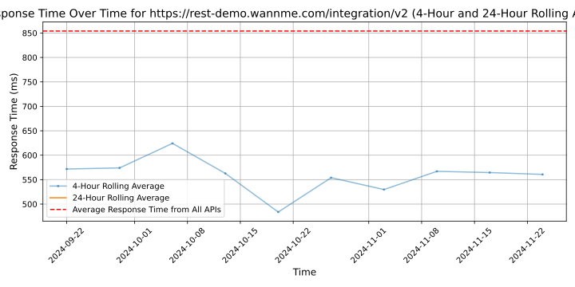

# [WANNME](https://www.wannme.com/en)

Wannme es una plataforma de pagos que gestiona todo el proceso del cobro, desde la pasarela de pago hasta las comunicaciones de tu tienda física u online. ¿Cómo lo hacemos? Mediante una única solución, una sola API.
¿Qué te ofrecemos? Una solución personalizada para ti y tu negocio, con múltiples funcionalidades que puedes combinar libremente, fácil de integrar, usar y sin sobrecostes. Todo y más a golpe de clic.
Queremos ser tu partner tecnológico y acompañarte en todo el proceso de cobro a tus clientes. Con la misma tecnología y procesos que usan los grandes, pero adaptada a lo que necesites (tarjeta de crédito, Bizum, efectivo, Split Payments, pagos PSD2… etc.) para que tú te centres en vender y tus clientes en comprar.
Do you want me?

## Response Times

#### [rest-demo.wannme.com/integration/v2](https://rest-demo.wannme.com/integration/v2)

