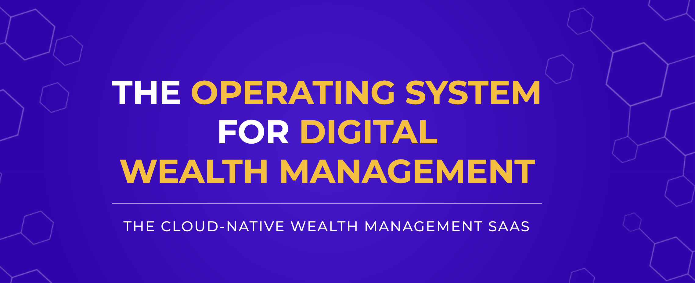

# [WealthOS](https://wealthos.cloud)

WealthOS is an API first, enterprise, core wealth management platform built to accelerate digital adoption and innovation within the wealth management industry.

By leveraging the latest advances in cloud-native technologies, WealthOS will offer the wealth management industry the upgraded technology infrastructure that's powering digital innovation in the financial services industry.

We plan to offer an extensive feature set coupled with pre-built integration to a market place of specialist service providers, allowing wealth managers to do more things on a single platform.

Our modular architecture allows you to use WealthOS fully to launch your entire digital value proposition, or in parts to complement an existing proposition. Our API first platform allows you to simply plug, and play.

 WealthOS dramatically reduces time to market for wealth management products and features while also reducing the total cost of ownership.

